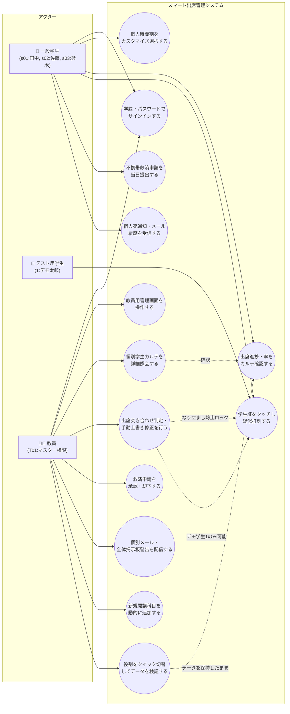
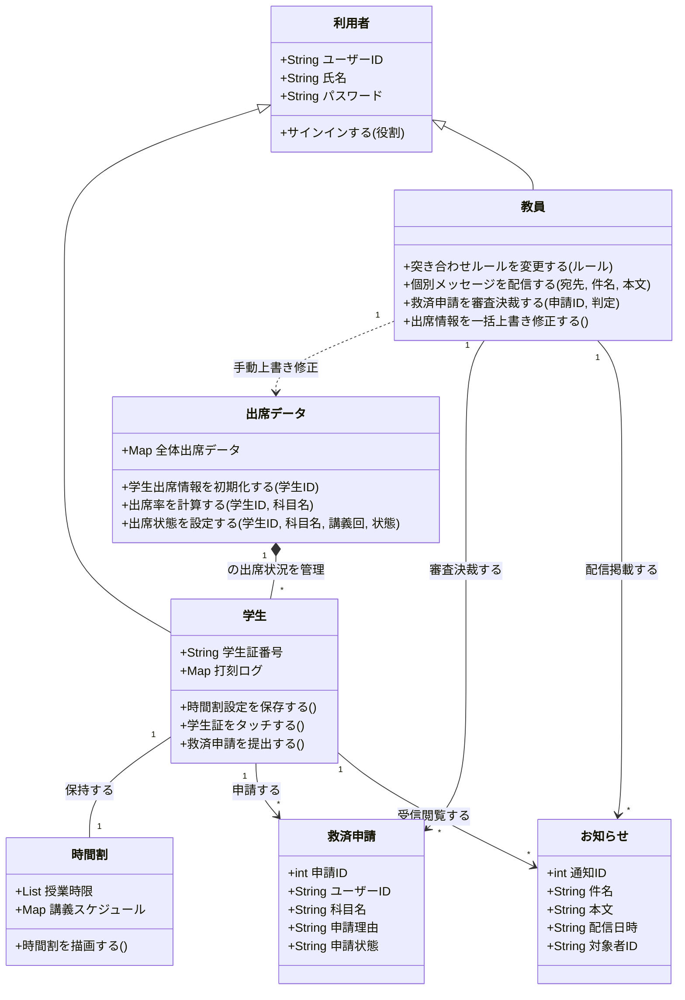
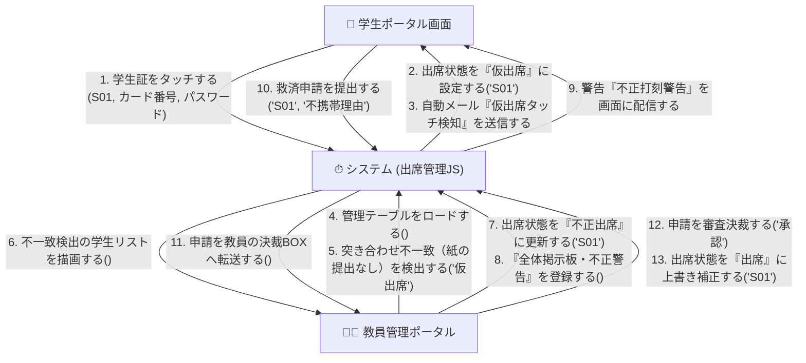
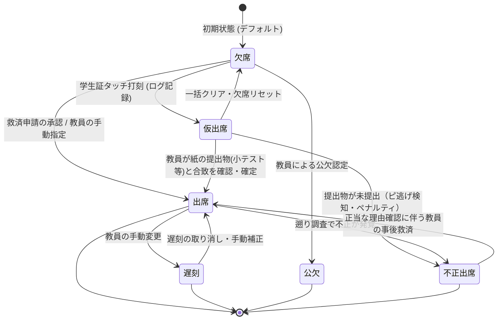
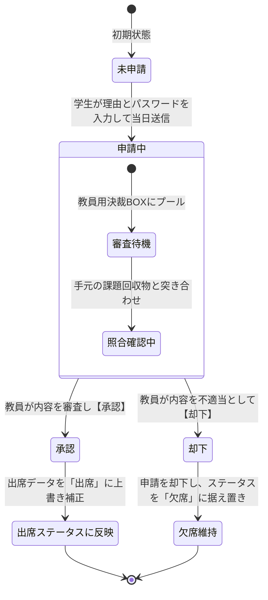

# make-app
# 出席確認アプリ

# 📱 スマート出席管理システム (Smart Attendance Management System)

## 📝 アプリ概要
本システムは、大学の講義における「不正打刻（ピ逃げ（不正出席）・身代わり打刻）」を高度な照合ロジックで防止し、学生の不携帯時の救済申請から教員の承認、さらにリアルタイムな学内掲示板への警告配信までを一元管理する、次世代型のスマート出席管理システムです。

💡 教室タッチシステムの疑似的な代替（シミュレーター位置づけ）

実際の運用環境では「教室の入り口や壁に物理的なICカードリーダー（タッチシステム）」が設置されていますが、Webブラウザ上のデモでこれを再現するため、ポータル右側の入力パネルを「教室設置型カードタッチ端末のシミュレーター（疑似代替）」として位置づけて設計しています。

学生は自身のスマホやPCから講義を選択した上で、この疑似タッチ端末（右側パネル）に学生証番号を入力して『タッチ』することで、実際に教室でカードをかざした時と全く同じ「打刻ログの生成」と「仮出席データの作成」を擬似的に実行できます。

🔄 デモ発表を円滑にする「役割クイック切替」機能

一般的なWebアプリでは、学生から教員へ画面を切り替える際に「一度ログアウトして別のアカウントでサインインし直す」という手間が発生し、デモ発表時のタイムロスやデータの不連続性が課題となります。

本システムでは、ヘッダーに配置された 🔄 役割クイック切替 ボタンを押すだけで、内部の出席データや通知履歴などの状態を完全に維持したまま、「一般学生の視点（なりすましロック状態）」と「教員のマスター管理視点」を1クリックで瞬時に往来できます。審査員の前で「学生が打刻した瞬間、教員側にどう見えているか」を流れるようにプレゼン可能です。また、アプリの動作を簡単に確認できるように機能を生徒側、教員側で追加しています。本格的な運用になれば、学生側からは確認できないようになります。

### 🌟 本システムのアピールポイント（品質とセキュリティ）
1. **厳格ななりすましロック**: 一般学生画面からは他人の代理打刻や不正な救済申請を徹底的にブロック。
2. **検証用デモモードの搭載**: テスト用学生「学籍番号: 1」のみ、教員側からの代理打刻を許可する特権ロジックを実装。
3. **データ即時連動**: 救済申請が承認されると、欠席データが即座に出席へと上書き反映。
4. **安心の例外制御**: パスワード不一致などの認証エラー時には、自動通知メールの送信を完全に遮断。

---

## 🚀 使い方・操作マニュアル

### 1. サインイン（役割の切り替え）
* **一般学生として利用する場合**:
  * 「学生」タブを選択し、学籍番号（例: `S01`）、カードID（例: `4321`）、パスワード（`1`）を入力してサインインします。
* **教員として利用する場合**:
  * 「教員」タブを選択し、教員ID（`T01`）、任意のパスワードを入力してサインインします。
* **テスト用学生として利用する場合**:
  * 「学生」タブで学籍番号（`1`）、パスワード（`1`）を入力すると、超速デモポータルが開きます。

### 2. 学生の操作（打刻と救済申請）
* **疑似打刻**: 
  * 自分の時間割から対象の講義を選択し、パスワードを入力して右側のエリアで「カードタッチ」を行います。認証が成功すると「仮出席」となります。
* **救済申請（学生証不携帯時など）**:
  * 学生証を忘れた場合、「救済申請」フォームから講義回と正当な理由を入力して送信します。※ログイン中の本人以外の学籍番号での申請はエラーとなります。

### 3. 教員の操作（管理と承認・配信）
* **学生カルテ・出席一括操作**:
  * 学生の出席状況をリアルタイムに一覧・個別確認できます。「全員一括出席」や「仮出席（成果物なし）の不正出席引き下げ」がワンクリックで行えます。
* **救済申請審査（決裁BOX）**:
  * 学生から届いた救済申請をリアルタイムに審査し、「承認」を押すことで対象学生のステータスを即座に「出席」へ補正します。
* **全体掲示・警告配信**:
  * 不正打刻を検知した際など、送信先を「全体掲示板」にして警告文を配信すると、全学生のポータルへ即座に通知が掲示されます。

---

要件定義（設計当初）

【目的】教員の出席集計コストを削減しつつ、学生証の「タッチ記録（ログ）」と、各教員が独自に行う「対面での出席確認（紙の出席票や課題提出）」をシステム上で突き合わせ、「ピ逃げ」や「不携帯・忘れ」を厳格に管理・手動補正できる出席管理システム。

【利用者の入出力】学生: 擬似打刻画面で学籍番号を送信（入力） $\rightarrow$ 自身の出席率・打刻履歴・申請状況を確認（出力）。学生（例外）: タッチ忘れ・学生証忘れの「救済申請（理由付き）」を提出（入力）。教員: 学生一覧を見ながら、紙の提出物等と照合して「出席・欠席・遅刻・公欠・ピ逃げ（不正行為）」をチェックボックスやプルダウンで一括変更・確定する（入力） $\rightarrow$ 履修者全体の出席率一覧を確認（出力）。

【制約】Python + Flask、データはSQLiteまたはCSVで管理 。学生は自身のステータスを直接変更できない（教員のみ変更権限あり）。センサーによる2回タッチや自動判定は行わず、すべて教員の手動操作による上書きを正とする。  

【受け入れ基準】学生が画面から擬似打刻できること、教員が紙の出席票などの結果を基にシステム上のステータスを「ピ逃げ」等へ一括して上書き更新できること、学生からの救済申請に対して教員が承認・却下を下せること。

【非目標】本物のICカードリーダーの接続、センサーによる複数回打刻の検知、システムによるピ逃げの自動判定ロジックの実装。

# システム設計図面
　ユースケース図

クラス図

協調図

状態遷移図
出席判定

タッチ申請

## テストケース
テストケース一覧と実行結果

| # | テスト対象 | テスト観点(正常/境界/異常) | テスト条件 | テスト手順(1行) | 期待値(1行) | 結果(◯/×) |
|---|---|---|---|---|---|---|
| 1 | サインイン | 正常 | 一般学生「S01」の正しいカード、パスワード | 学生タブでID「S01」、カード「4321」、パスワード「1」を入力しサインインを押す | 学生ポータルが開き、「田中 太郎」の名前と時間割が表示される | ◯ |
| 2 | サインイン | 正常 | 教員アカウント「T01」の管理サインイン | 教員タブで教員ID「T01」、任意の教員パスワードを入力しサインインを押す | 教員管理ポータルが開き、上部にポータル切り替えタブが出現する | ◯ |
| 3 | サインイン | 正常 | デモ学生「1」の超速サインイン | 学生タブで学籍番号「1」、パスワード「1」を入力しサインインを押す | 「1 - デモ 太郎」のポータルが開き、クイック切替等が活性化する | ◯ |
| 4 | サインイン | 異常 | 必須入力欄の空欄チェック | ID欄を空、パスワードのみ入力した状態で「サインインしてポータルを開く」を押す | 「エラー: 入力値に不備があります」と赤色のエラー警告通知が出る | ◯ |
| 5 | サインイン | 境界 | 存在しない新規IDでの初回自動登録 | 学生タブで「S99」という新規ID、任意のカード・パスワードを入れ決定する | 自動的に「学生 S99」として新規データ領域が作成され、ポータルが開く | ◯ |
| 6 | 時間割設定 | 正常 | 履修科目のカスタマイズ反映 | 個人時間割の月曜1限を「英語Ⅰ」から「プログラミング」にセレクト変更し保存する | ダッシュボードの時間割（月曜1限）の表示が「プログラミング」に変わる | ◯ |
| 7 | 時間割設定 | 境界 | すべての履修コマを「未選択(-)」にして保存 | 時間割設定ですべてのセレクトボックスを「-」にして「設定を保存する」を押す | 保存され、ダッシュボードの時間割表の全マス目が空白になる | ◯ |
| 8 | 疑似打刻 | 正常 | 通常ログインした学生本人による打刻 | 講義「英語Ⅰ」の盤面をクリックし、右側で「S01」「s01」を入力しタッチする | 「仮出席」として打刻され、左下の通知履歴に「カードタッチ自動通知」が入る | ◯ |
| 9 | 疑似打刻 | 異常 | 不一致パスワードでの打刻失敗 | 講義「データベース（木）」で、パスワード欄にわざと「wrong」と入力してタッチする | 「認証エラー」と表示され、自動通知メールは一切送信（履歴追加）されない | ◯ |
| 10 | 疑似打刻 | 正常 | 教員閲覧時のデモ学生「1」への代理打刻 | 教員側から閲覧学生「1」を選択し、右側で「1」「1」を入力しタッチする | デモ学生「1」の打刻が通り、ステータスが「仮出席」になる | ◯ |
| 11 | 疑似打刻 | 異常 | 教員閲覧時の一般学生代理打刻ロック |教員側から一般の閲覧学生「S01」を選択し、右側の打刻エリアを確認する | 「代理打刻制限のお知らせ」が表示されて入力エリアがロック（非表示）される | ◯ |
| 12 | 救済申請 | 正常 | 講義当日の曜日に救済申請を提出 | シミュレーション日に「水曜の日付」を設定し、水曜の「ソフトウェア」の申請を送る | 送信に成功し、教員側の未処理の救済申請BOXに即座に表示される | ◯ |
| 13 | 救済申請 | 正常（異常結果） | IDの一致 | ログイン時のIDと同じIDをタッチ入力する | エラーが起きずに送信に成功し、メールに通知される | ×（現在は修正済み） |
| 14 | 救済申請 | 境界 | 理由を空欄にしたままでの不携帯申請 | パスワードのみ入力し、不携帯理由を完全に空にして送信ボタンを押す | 入力バリデーションに引っかかり、「申請理由が正しく入力されていません」と出る | ◯ |
| 15 | 救済申請 | 異常 | 閲覧モードの一般学生画面からの不携帯申請 | 教員閲覧モードの「S01」画面で救済申請の送信を押そうとする | ボタンが非活性（disabled）になり、代理送信制限の注意書きが出る | ◯ |
| 16 | 教員管理 | 正常 | 新規開講科目「情報ネットワーク」の動的追加 | 教員画面で新規科目に「情報ネットワーク」と入力し「追加」ボタンを押す | 追加に成功し、プルダウンや時間割の編集選択肢に即座に追加される | ◯ |
| 17 | 教員管理 | 正常 | 出席突き合わせ判定ルールの切替 | 突き合わせ基準を「確認小テストと照合」に変更し、更新内容を確認する | 「現在の設定: 照合方法」の表示ラベルが「確認小テストと照合」に更新される | ◯ |
| 18 | 教員管理 | 正常 | 出席一括操作（全員出席化）のデモ実行 | ソフトウェア第1回を選択し、「全員一括で出席にする」を押す | 確認モーダルが表示され、「はい」を押すとテーブルの全員が「出席」に変わる | ◯ |
| 19 | 教員管理 | 境界 | 仮出席（ピ逃げ疑い）のみを一括して「不正出席」にする | ソフトウェア第8回で「仮出席を全員不正出席にする」を押す | 回収物の無い仮出席の学生のみ「不正出席」に引き下げ判定される | ◯ |
| 20 | 教員管理 | 正常 | 手動修正テーブルのステータスフィルター | フィルターボタンの「不正出席」または「仮出席」をクリックする | テーブルに該当ステータスを持つ学生行だけが絞り込まれて描画される | ◯ |
| 21 | 教員管理 | 境界 | 個別学生の出席状態の直接手動修正 | 「manual-student-id」に「S01」と入れ、判定「遅刻」を選び決定を押す | 「S01」の特定の講義回の出席ステータスが即座に「遅刻」へ上書きされる | ◯ |
| 22 | 救済申請審査 | 正常 | 決裁BOXでの救済申請の「承認」 | 届いた救済申請（S02佐藤）の「承認」ボタンを押す | 申請が「承認」済みに消え、対象学生の出席データが「出席」に上書き補正される | ◯ |
| 23 | 救済申請審査 | 正常 | 決裁BOXでの救済申請の「却下」 | 届いた救済申請の「却下」ボタンを押す | 申請が「却下」になり、対象学生の出席状態は「欠席」のまま変わらない | ◯ |
| 24 | 教員配信 | 正常 | 全体掲示板への「不正打刻警告」の直接投稿 | 送信先で「全体掲示板」を選択し、不正警告文を作成し配信ボタンを押す | 学生ポータルの「学内全体掲示・不正打刻警告」エリアに即時反映される | ◯ |
