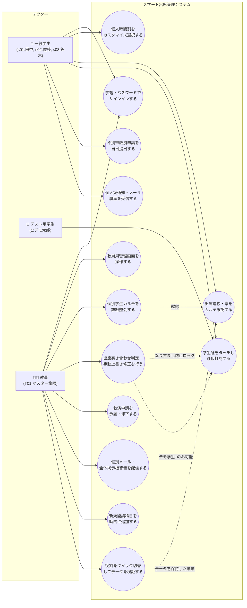
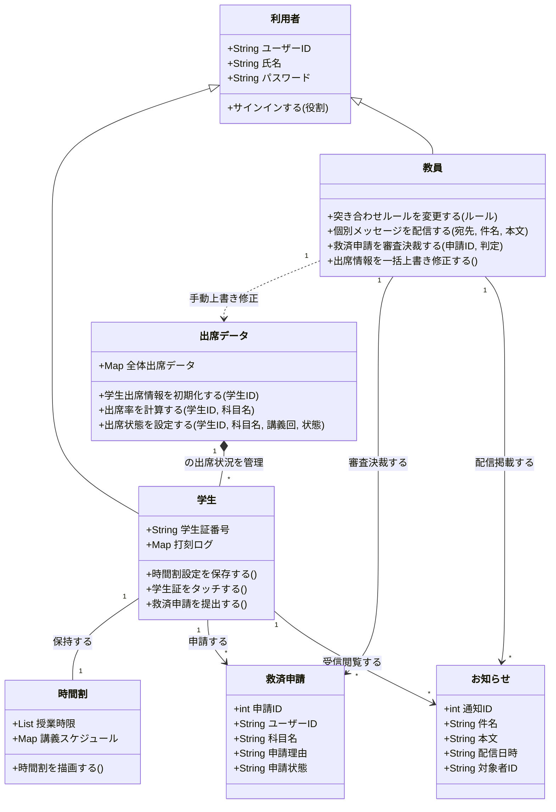
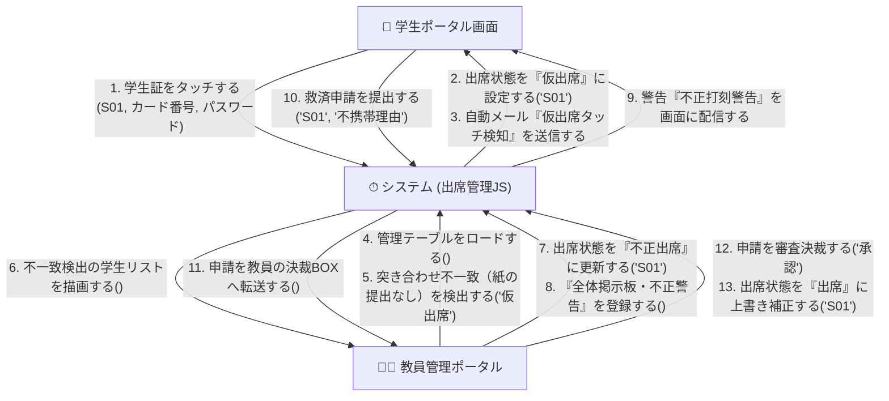
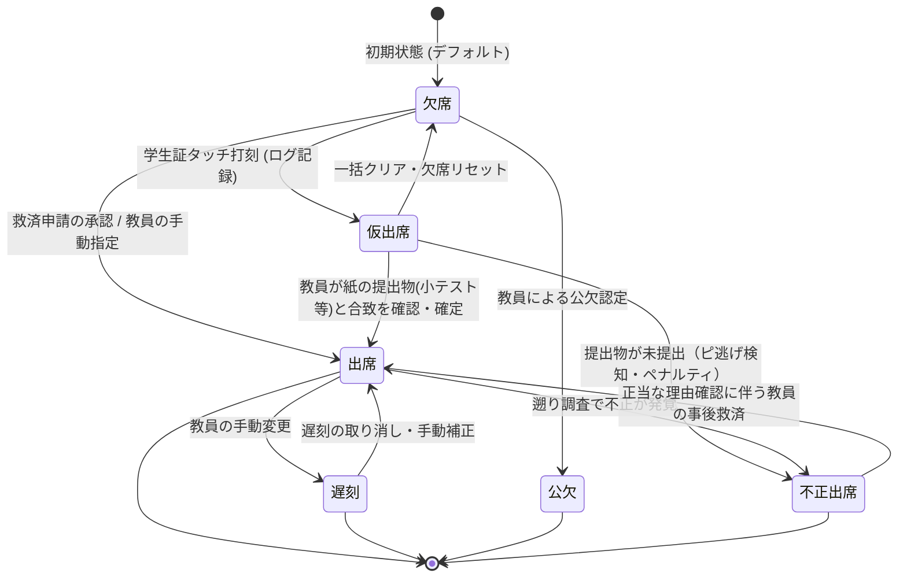
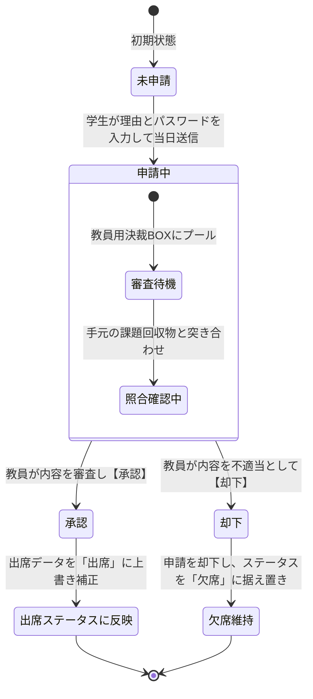

# make-app
# 出席確認アプリ

学籍番号と学生証の番号をシステムに関連付け、授業時間割を表示するアプリです。

## 主な機能
- 学籍番号・学生証番号の入力とバリデーション
- 月曜〜土曜、1〜6限の授業時間割の自動表示
- レスポンシブデザイン対応

# システム設計図面
　ユースケース図

```mermaid
flowchart LR
    %% アクターの定義
    subgraph アクター
        Student["👤 一般学生<br>(s01:田中, s02:佐藤, s03:鈴木)"]
        DemoStudent["🤖 テスト用学生<br>(1:デモ太郎)"]
        Teacher["👨‍🏫 教員<br>(T01:マスター権限)"]
    end

    %% システム境界とユースケース
    subgraph スマート出席管理システム
        UC1((学籍・パスワードで<br>サインインする))
        UC2((個人時間割を<br>カスタマイズ選択する))
        UC3((出席進捗・率を<br>カルテ確認する))
        UC4((学生証をタッチし<br>疑似打刻する))
        UC5((不携帯救済申請を<br>当日提出する))
        UC6((個人宛通知・メール<br>履歴を受信する))
        
        UC7((教員用管理画面を<br>操作する))
        UC8((個別学生カルテを<br>詳細照会する))
        UC9((出席突き合わせ判定・<br>手動上書き修正を行う))
        UC10((救済申請を<br>承認・却下する))
        UC11((個別メール・<br>全体掲示板警告を配信する))
        UC12((新規開講科目を<br>動的に追加する))
        UC13((役割をクイック切替<br>してデータを検証する))
    end

    %% 学生のユースケース接続
    Student --> UC1
    Student --> UC2
    Student --> UC3
    Student --> UC4
    Student --> UC5
    Student --> UC6

    %% デモ学生の打刻
    DemoStudent --> UC4

    %% 教員のユースケース接続
    Teacher --> UC1
    Teacher --> UC7
    Teacher --> UC8
    Teacher --> UC9
    Teacher --> UC10
    Teacher --> UC11
    Teacher --> UC12
    Teacher --> UC13

    %% 関係性の依存・拡張
    UC13 -.-> |データを保持したまま| UC3
    UC8 -.-> |確認| UC3
    UC9 -.-> |なりすまし防止ロック| UC4
    UC9 -.-> |デモ学生1のみ可能| UC4
```
クラス図

```mermaid
classDiagram
    class 利用者 {
        +String ユーザーID
        +String 氏名
        +String パスワード
        +サインインする(役割)
    }

    class 学生 {
        +String 学生証番号
        +Map 打刻ログ
        +時間割設定を保存する()
        +学生証をタッチする()
        +救済申請を提出する()
    }

    class 教員 {
        +突き合わせルールを変更する(ルール)
        +個別メッセージを配信する(宛先, 件名, 本文)
        +救済申請を審査決裁する(申請ID, 判定)
        +出席情報を一括上書き修正する()
    }

    class 時間割 {
        +List 授業時限
        +Map 講義スケジュール
        +時間割を描画する()
    }

    class 出席データ {
        +Map 全体出席データ
        +学生出席情報を初期化する(学生ID)
        +出席率を計算する(学生ID, 科目名)
        +出席状態を設定する(学生ID, 科目名, 講義回, 状態)
    }

    class 救済申請 {
        +int 申請ID
        +String ユーザーID
        +String 科目名
        +String 申請理由
        +String 申請状態
    }

    class お知らせ {
        +int 通知ID
        +String 件名
        +String 本文
        +String 配信日時
        +String 対象者ID
    }

    利用者 <|-- 学生
    利用者 <|-- 教員
    学生 "1" -- "1" 時間割 : 保持する
    出席データ "1" *-- "*" 学生 : の出席状況を管理
    教員 "1" ..> 出席データ : 手動上書き修正
    学生 "1" --> "*" 救済申請 : 申請する
    教員 "1" --> "*" 救済申請 : 審査決裁する
    教員 "1" --> "*" お知らせ : 配信掲載する
    学生 "1" --> "*" お知らせ : 受信閲覧する

```

協調図

```mermaid
graph TD
    %% オブジェクト定義
    StudentObj["👤 学生ポータル画面"]
    SystemObj["⏱ システム (出席管理JS)"]
    TeacherObj["👨‍🏫 教員管理ポータル"]

    %% 学生打刻・確認シナリオ
    StudentObj -- "1. 学生証をタッチする(S01, カード番号, パスワード)" --> SystemObj
    SystemObj -- "2. 出席状態を『仮出席』に設定する('S01')<br>3. 自動メール『仮出席タッチ検知』を送信する" --> StudentObj

    %% 教員確認・不正(ピ逃げ)警告判定シナリオ
    TeacherObj -- "4. 管理テーブルをロードする()<br>5. 突き合わせ不一致（紙の提出なし）を検出する('仮出席')" --> SystemObj
    SystemObj -- "6. 不一致検出の学生リストを描画する()" --> TeacherObj
    TeacherObj -- "7. 出席状態を『不正出席』に更新する('S01')<br>8. 『全体掲示板・不正警告』を登録する()" --> SystemObj
    SystemObj -- "9. 警告『不正打刻警告』を画面に配信する" --> StudentObj

    %% 救済申請シナリオ
    StudentObj -- "10. 救済申請を提出する('S01', '不携帯理由')" --> SystemObj
    SystemObj -- "11. 申請を教員の決裁BOXへ転送する()" --> TeacherObj
    TeacherObj -- "12. 申請を審査決裁する('承認')<br>13. 出席状態を『出席』に上書き補正する('S01')" --> SystemObj
```

状態遷移図
出席判定

```mermaid
stateDiagram-v2
    [*] --> 欠席 : 初期状態 (デフォルト)
    
    欠席 --> 仮出席 : 学生証タッチ打刻 (ログ記録)
    欠席 --> 出席 : 救済申請の承認 / 教員の手動指定
    欠席 --> 公欠 : 教員による公欠認定
    
    仮出席 --> 出席 : 教員が紙の提出物(小テスト等)と合致を確認・確定
    仮出席 --> 不正出席 : 提出物が未提出（ピ逃げ検知・ペナルティ）
    仮出席 --> 欠席 : 一括クリア・欠席リセット
    
    遅刻 --> 出席 : 遅刻の取り消し・手動補正
    出席 --> 遅刻 : 教員の手動変更
    出席 --> 不正出席 : 遡り調査で不正が発覚
    
    不正出席 --> 出席 : 正当な理由確認に伴う教員の事後救済
    
    出席 --> [*]
    遅刻 --> [*]
    公欠 --> [*]
    不正出席 --> [*]
```

タッチ申請

```mermaid
stateDiagram-v2
    [*] --> 未申請 : 初期状態
    
    未申請 --> 申請中 : 学生が理由とパスワードを入力して当日送信
    
    state 申請中 {
        [*] --> 審査待機 : 教員用決裁BOXにプール
        審査待機 --> 照合確認中 : 手元の課題回収物と突き合わせ
    }
    
    申請中 --> 承認 : 教員が内容を審査し【承認】
    申請中 --> 却下 : 教員が内容を不適当として【却下】
    
    承認 --> 出席ステータスに反映 : 出席データを「出席」に上書き補正
    却下 --> 欠席維持 : 申請を却下し、ステータスを「欠席」に据え置き
    
    出席ステータスに反映 --> [*]
    欠席維持 --> [*]
```
